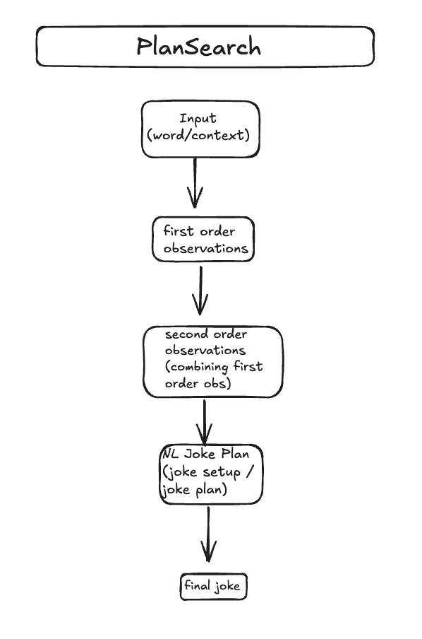
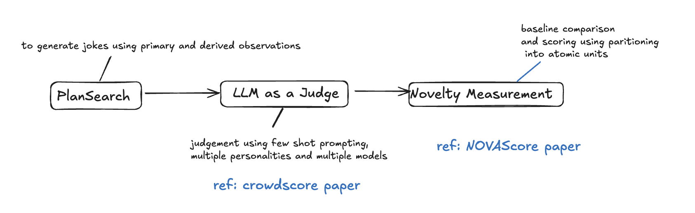

# funniest-joke-with-LLMs
Plansearch and LLM as a Judge Implementation

`User provides a topic → Generate N candidate jokes about that topic → LLM ranks them → Output top-k jokes about that topic`


`Topic (e.g., "penguins", "VM") ➝ Premises / Observations ➝ Derived Punchline Ideas ➝ Joke Setup ➝ Full Joke`


## Overview




### ⭐️⭐️⭐️ Output of the input context word is saved in `output_report.md` !

### Example Run 
Refer to `output_eg.md`
---


### Report and Answers to questions
```Why did you pick the particular project?
If you had more compute/time, what would you have done?
What did you learn in the project?
What surprised you the most?
If you had to write a paper on the project, what else needs to be done?
```

Refer to `Report.md`

### PlanSearch workflow
Refer to `plasearch_workflow.md`

### Runs
use `uv`
Generate a `Groq api key` from `https://console.groq.com/keys`

```
uv venv           
uv pip install -r pyproject.toml  
uv run src/main.py            
```

### Output example run of the whole pipeline
Refer to `output_eg.md`

### Outputs for a joke context/word
The above code runs the main file and generates an output based on the given context word
Refer to `output_report.md`